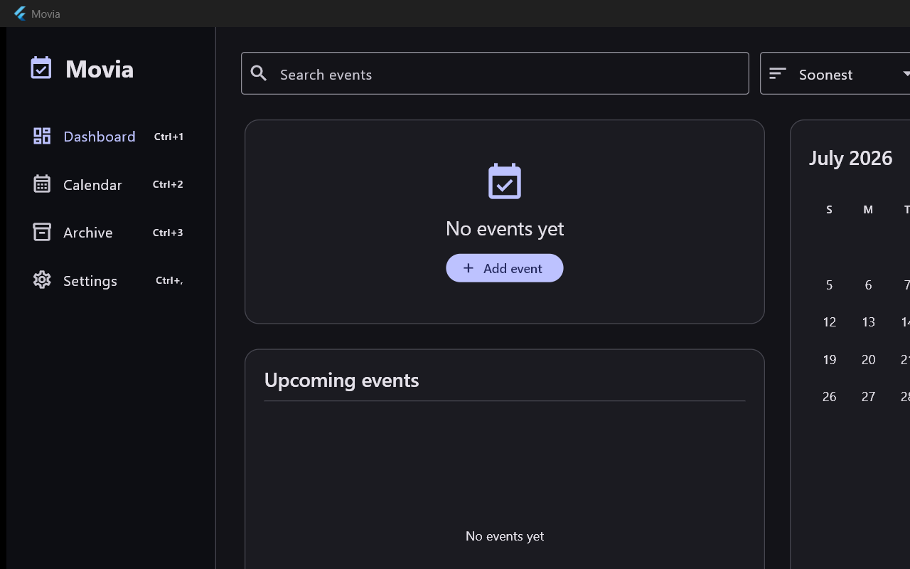
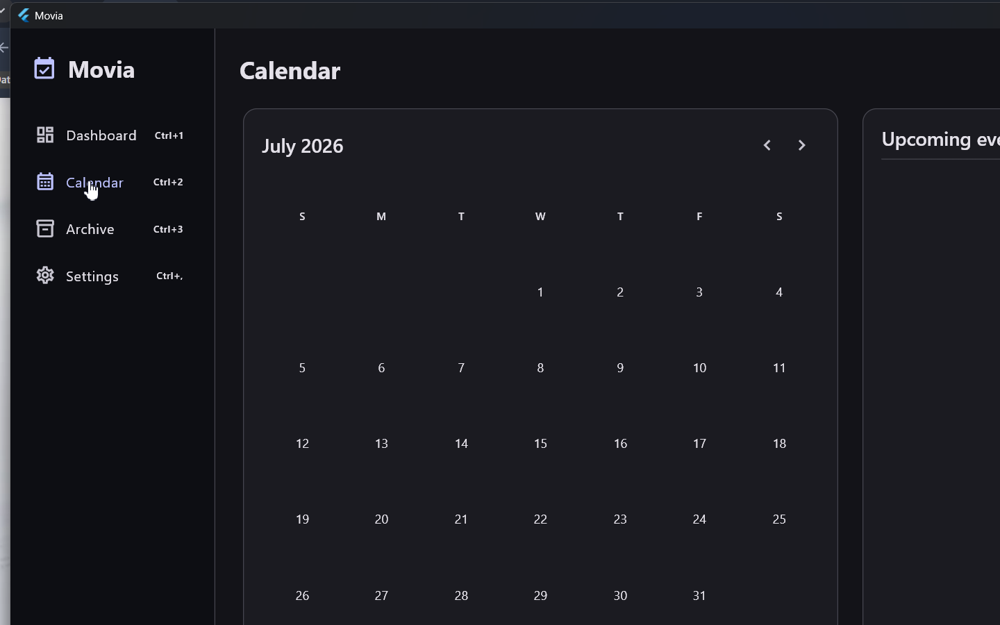
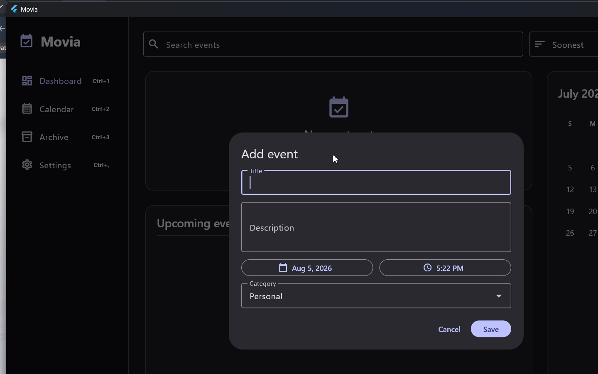
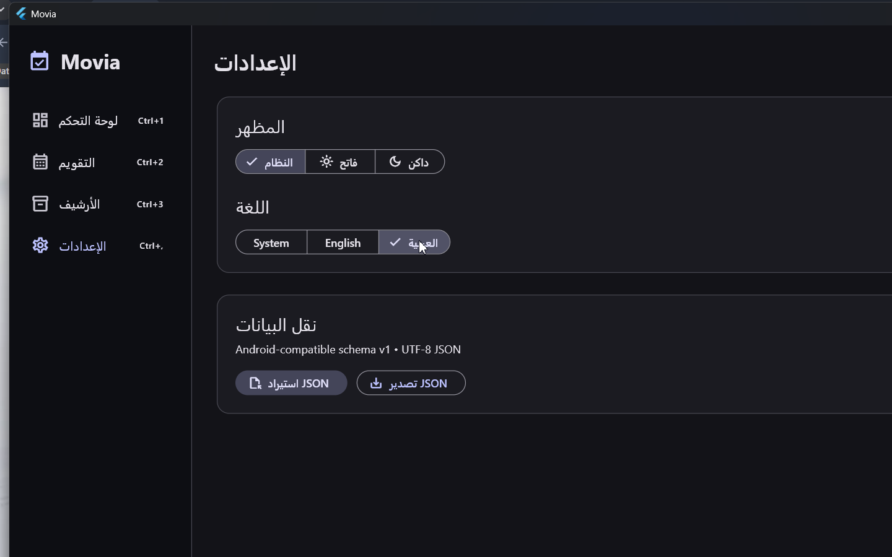

# Movia Desktop

Movia Desktop is a bilingual countdown and moments application for Windows, built with Flutter. It keeps events on the local computer while providing calendar planning, live countdowns, desktop companion widgets, and English/Arabic interfaces with right-to-left layout support.



Current release: **1.1.0**

## Product overview

Movia is designed for personal events, deadlines, milestones, and past moments. It combines a full desktop application with a compact companion window, without requiring an account or cloud service.

Key capabilities include:

- Dashboard, calendar, event details, and live countdown timers
- Add, edit, delete, archive, restore, search, sort, and categorize events
- Compact, Countdown, and Upcoming companion-widget styles
- Local SQLite persistence with a non-destructive schema migration
- English and Arabic localization, including RTL layout
- Light, Dark, and System themes
- Keyboard shortcuts and context menus
- Android-compatible JSON import and export
- GitHub Releases update checks with optional SHA-256 verification

## Screenshots

| Calendar | Event form |
| --- | --- |
|  |  |

| Arabic and RTL | Dashboard |
| --- | --- |
|  |  |

The committed screenshots use empty or sample-free application states and contain no personal event data.

## Install on Windows

Download release files only from the official [GitHub Releases page](https://github.com/Ahmed-Abdelall/movia-desktop/releases/latest).

### Installer

1. Download `Movia-Desktop-Setup-1.1.0.exe` from the latest release.
2. Optionally download the matching `.sha256` sidecar and verify the file as described below.
3. Run the installer and follow the prompts.

The installer is currently unsigned, so Windows SmartScreen may show an unknown-publisher warning. Continue only when the file came from this repository's official release page and its checksum matches the published sidecar.

### Portable version

1. Download `Movia-Desktop-1.1.0-portable.zip`.
2. Verify the optional checksum.
3. Extract the complete archive to a writable folder.
4. Run `movia_desktop.exe` from the extracted folder.

Do not run the executable from inside the ZIP. Portable users update manually by closing Movia and replacing the extracted application files with a newer official release.

### Verify a release checksum

From PowerShell, run:

```powershell
Get-FileHash .\Movia-Desktop-Setup-1.1.0.exe -Algorithm SHA256
```

Compare the result with `Movia-Desktop-Setup-1.1.0.exe.sha256` from the same release. The portable ZIP has its own matching checksum file.

## Data storage and privacy

Movia stores event data in a local SQLite database at:

```text
%APPDATA%\Ahmed Abdelaal\Movia Desktop\movia.db
```

- No user account is required.
- No analytics or tracking is included.
- Event data is not uploaded to a cloud service.
- JSON imports are validated before a transactional merge or replacement.
- Application settings and widget preferences are stored for the current Windows user.

Users remain responsible for backing up their local database and exported JSON files.

## Desktop companion widget

The companion widget is a second Flutter window in the Movia process; it is not a Windows 11 Widget Board integration.

- **Compact:** icon, event title, remaining days, and date
- **Countdown:** days, hours, minutes, and seconds
- **Upcoming:** the next three active events

The window can be moved, resized while unlocked, kept on top, and configured for opacity and style. Its selected event, position, size, lock state, and display preferences persist. Start-with-Windows is opt-in and uses the current user's standard Windows Run registry entry without requiring administrator privileges.

## Update mechanism

Movia checks the public GitHub Releases API for stable releases from this repository. It ignores drafts and prereleases, compares numeric versions, and accepts only the expected installer filename from the repository's HTTPS release path.

Automatic checks are preference-controlled and limited to once every 24 hours. When a matching checksum asset is available, Movia calculates SHA-256 and refuses a mismatched download. Installation still requires explicit user action.

See [Update system](docs/UPDATE_SYSTEM.md) for the implementation contract.

## Architecture and engineering decisions

The application uses a feature-first structure with separated domain, data, application, and presentation responsibilities:

- **Flutter and Dart** for the Windows interface
- **Riverpod** for application state
- **GoRouter** for navigation
- **SQLite** through `sqflite_common_ffi` for local persistence
- **Material 3** for the interface system
- **Inno Setup** for the Windows installer

Version 1.1.0 includes a non-destructive SQLite migration that adds creation and modification timestamps. The JSON adapter follows a documented Android schema-v1 interchange format. The companion widget shares the same database and preferences rather than maintaining a second data store.

More detail is available in [Architecture](docs/ARCHITECTURE.md), [Android JSON compatibility](docs/ANDROID_JSON_COMPATIBILITY.md), and [Desktop widget](docs/DESKTOP_WIDGET.md).

## Development and validation

Requirements:

- Flutter 3.44.8
- Visual Studio 2022 with **Desktop development with C++**
- Windows Developer Mode

```powershell
flutter pub get
flutter analyze
flutter test
flutter build windows --release
```

The release bundle is generated under `build\windows\x64\runner\Release\`.

The Windows GitHub Actions workflow restores dependencies, runs static analysis and tests, and builds the release application. Tagged builds additionally produce the installer, portable ZIP, and SHA-256 sidecars before publishing release artifacts.

## Release management

The project maintains versioned release notes, a changelog, tagged GitHub Releases, installer and portable artifacts, and checksum sidecars. Release preparation keeps the version synchronized across Flutter and Inno Setup, validates the Windows build, and tests in-place installer upgrades.

- [Latest release](https://github.com/Ahmed-Abdelall/movia-desktop/releases/latest)
- [Release notes](RELEASE_NOTES.md)
- [Changelog](CHANGELOG.md)
- [Release process](docs/RELEASE_PROCESS.md)
- [Windows build and packaging](docs/BUILD_WINDOWS.md)

## Keyboard navigation

- `Escape` or `Alt+Left`: go back
- `Ctrl+N`: add an event
- `Ctrl+1`: open Dashboard
- `Ctrl+2`: open Calendar
- `Ctrl+3`: open Archive
- `Ctrl+,`: open Settings

## Known limitations

- Releases currently target Windows only.
- The installer is unsigned and may trigger a SmartScreen warning.
- The companion widget is an application window, not a Windows Widget Board extension.
- Portable installations require manual updates.
- Data is local to one Windows profile; there is no account-based sync or cloud backup.

## Roadmap

Future work will be evaluated conservatively around accessibility QA, broader automated coverage, release signing, and continued Android data-interchange compatibility. Roadmap items are proposals, not committed release dates.

## Documentation

- [Architecture](docs/ARCHITECTURE.md)
- [Desktop widget](docs/DESKTOP_WIDGET.md)
- [Update system](docs/UPDATE_SYSTEM.md)
- [Android JSON compatibility](docs/ANDROID_JSON_COMPATIBILITY.md)
- [Windows build and packaging](docs/BUILD_WINDOWS.md)
- [Contributing](CONTRIBUTING.md)

## License

Movia Desktop is released under the [MIT License](LICENSE).

## Author and support

Created and maintained by [Ahmed Abdelaal](https://github.com/Ahmed-Abdelall).

For reproducible bugs or documentation problems, use the repository's [GitHub Issues](https://github.com/Ahmed-Abdelall/movia-desktop/issues). Do not include private event data in an issue.
