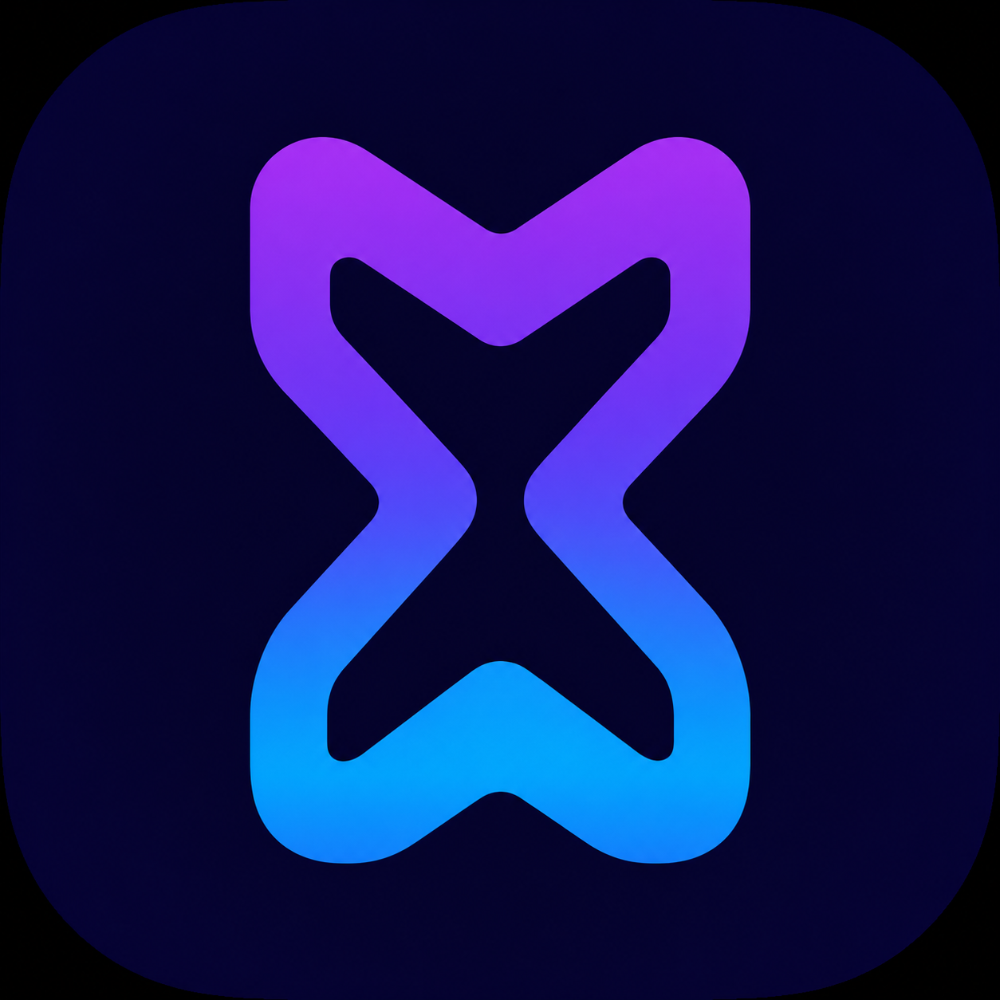

# Movia Desktop

A bilingual countdown and moments desktop application for Windows, built with
Flutter.



Current version: **1.2.1**

Movia Desktop helps you organize important moments, events, deadlines, and
countdowns in a focused Windows interface. It is an independent desktop project;
all data stays on your computer.


## Features

- Event creation and modification timestamps with safe schema migration
- Secure GitHub Releases update checks and SHA-256 verification
- Dashboard with live countdown, navigable calendar, and event summary
- Calendar view and event details
- Add, edit, and delete events
- Archive and restore
- Search, sorting, and categories
- Local SQLite storage
- English and Arabic localization with RTL layout
- Light, Dark, and System themes
- Keyboard shortcuts and context menus
- Responsive, resizable desktop interface
- Android-compatible JSON import and export

User data is stored outside the installation folder at
`%APPDATA%\Ahmed Abdelaal\Movia Desktop\movia.db`.

Keyboard navigation: `Escape` or `Alt+Left` goes back, `Ctrl+N` adds an event,
`Ctrl+1` opens Dashboard, `Ctrl+2` Calendar, `Ctrl+3` Archive, and `Ctrl+,`
opens Settings.

## Screenshots

| Calendar | Event form |
| --- | --- |
|  |  |

| Arabic and RTL | Dark dashboard |
| --- | --- |
|  |  |

The screenshots contain sample-free application states and no personal event
data.

## Technology

- Flutter and Dart
- Riverpod
- GoRouter
- SQLite through `sqflite_common_ffi`
- Material 3
- Native Windows runner and Inno Setup packaging

## Install

Download the latest files from the
[GitHub Releases page](https://github.com/Ahmed-Abdelall/movia-desktop/releases/latest):

1. **Portable Installed Mode (recommended on Smart App Control devices)** —
   extract `Movia-Desktop-1.2.1-portable-installed.zip`, verify it, then run
   `install-portable.ps1`. It installs per-user under
   `%LOCALAPPDATA%\Programs\Movia` and preserves AppData.
2. **Windows Installer** — for unrestricted Windows devices. The traditional
   installer is not verified on this Smart App Control device because its
   extracted Inno Setup process is blocked.
3. **Standalone Portable Mode** — extract the portable ZIP anywhere and run
   `movia_desktop.exe` directly; updates are applied manually.

Never disable or bypass Windows security to run Movia. Windows may authorize
one release binary and block another; source code cannot guarantee Smart App
Control authorization.

## Build from source

Requirements: Flutter 3.44.8 or compatible, Visual Studio 2022 with the
**Desktop development with C++** workload, and Windows Developer Mode.

```powershell
flutter pub get
flutter analyze
flutter test
flutter build windows --release
```

The release bundle is generated under
`build\windows\x64\runner\Release\`.

## Data and privacy

- All event data is stored locally in SQLite.
- No user account is required.
- No analytics or tracking is included.
- No data is uploaded to a cloud service.
- JSON import is validated before a transactional merge or replace.

## Architecture

Movia uses a feature-first structure with separated domain, data, application,
and presentation layers. Riverpod owns application state, GoRouter handles
navigation, and SQLite provides local persistence. The JSON adapter implements
the documented Android schema-v1 interchange format.

See [Architecture](docs/ARCHITECTURE.md) and
[Android JSON compatibility](docs/ANDROID_JSON_COMPATIBILITY.md).

## Portfolio value

This project demonstrates Flutter desktop development, responsive UI design,
local persistence, state management, localization and RTL behavior, Windows
packaging, and cross-platform data compatibility.

## Documentation

- [Architecture](docs/ARCHITECTURE.md)
- [Android JSON compatibility](docs/ANDROID_JSON_COMPATIBILITY.md)
- [Windows build and packaging](docs/BUILD_WINDOWS.md)
- [Release notes](RELEASE_NOTES.md)
- [Changelog](CHANGELOG.md)
- [Contributing](CONTRIBUTING.md)

## License

Released under the [MIT License](LICENSE).
